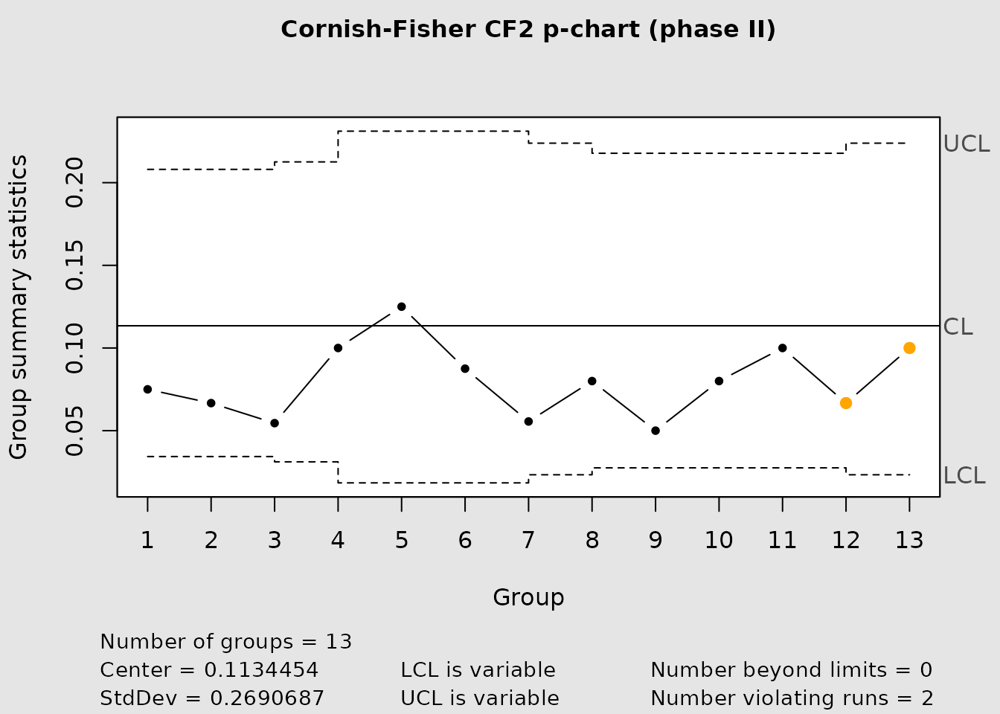
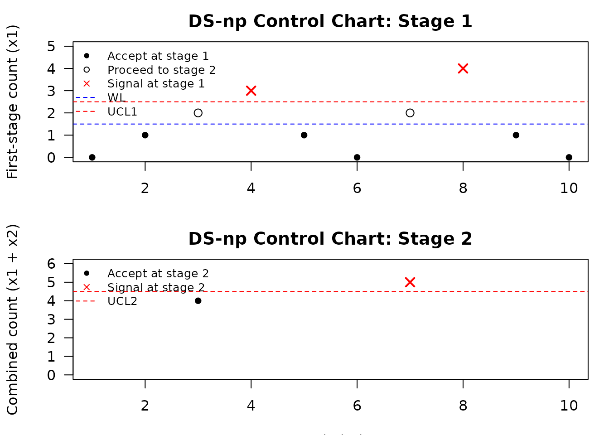

# High-quality processes and rare nonconformities

## Motivation

High-quality processes are processes in which nonconformities are rare.
In that setting, attribute data are highly discrete, bounded below by
zero, and often strongly asymmetric. Classical normal-approximation
control limits may therefore be poorly calibrated, even when the usual
chart is familiar and easy to apply.

IQCC addresses this problem with corrected p-chart limits, exact
binomial false-alarm calculations, and a complete double-sampling np
workflow including performance evaluation, automatic limit search, chart
construction, and plotting.

## Cornish-Fisher corrected p charts

IQCC distinguishes two corrected methods:

- `type = "cf1"` uses the first skewness correction;
- `type = "cf2"` uses the two-adjustment operational limits documented
  by Joekes and Barbosa (2013).

The following chunk is executed and compares all three limit methods.

``` r

methods <- c("normal", "cf1", "cf2")
p_results <- do.call(
  rbind,
  lapply(methods, function(method) {
    lim <- pchart_limits(p = 0.015, n = 20, type = method)
    risk <- pchart_alpha_risk(
      p = 0.015,
      n = 20,
      lcl = lim$lcl,
      ucl = lim$ucl
    )
    data.frame(
      method = method,
      lcl = lim$lcl,
      center = lim$center,
      ucl = lim$ucl,
      actual_alpha = risk,
      arl0 = ifelse(risk == 0, Inf, 1 / risk)
    )
  })
)
p_results
#>   method lcl center        ucl actual_alpha       arl0
#> 1 normal   0  0.015 0.09653924 0.0357458712   27.97526
#> 2    cf1   0  0.015 0.16120479 0.0002023458 4942.03542
#> 3    cf2   0  0.015 0.13031923 0.0031780828  314.65511
```

``` r

data(binomdata)
cchart.p(
  x1 = binomdata$Di[1:12],
  n1 = binomdata$ni[1:12],
  type = "cf2",
  x2 = binomdata$Di[13:25],
  n2 = binomdata$ni[13:25]
)
```



## Double-sampling np charts

A double-sampling np chart uses two possible sampling stages. A first
sample is inspected. If the count of nonconforming items is clearly
acceptable, the process is not signaled. If it is clearly large, the
chart signals immediately. If the count lies in an intermediate region,
a second sample is inspected and the combined count is used for the
final decision.

IQCC provides the complete DS-np workflow:

- [`dsnp_prob_accept()`](https://flaviobarros.github.io/IQCC/reference/dsnp_prob_accept.md)
  computes the total acceptance probability;
- [`dsnp_arl()`](https://flaviobarros.github.io/IQCC/reference/dsnp_arl.md)
  computes average run length;
- [`dsnp_ass()`](https://flaviobarros.github.io/IQCC/reference/dsnp_ass.md)
  computes average sample size;
- [`dsnp_limits()`](https://flaviobarros.github.io/IQCC/reference/dsnp_limits.md)
  searches and ranks feasible limits;
- [`cchart.DSnp()`](https://flaviobarros.github.io/IQCC/reference/cchart.DSnp.md)
  classifies observations and constructs the chart.

## Inspecting a published plan

``` r

n1 <- 34
n2 <- 162
wl <- 1.5
ucl1 <- 2.5
ucl2 <- 4.5
p0 <- 0.005
p1 <- 0.0075

published_plan <- data.frame(
  metric = c("P(accept | p0)", "ARL0", "ARL1", "ASS0"),
  value = c(
    dsnp_prob_accept(p0, n1, n2, wl, ucl1, ucl2)$pt,
    dsnp_arl(p0, n1, n2, wl, ucl1, ucl2)$arl,
    dsnp_arl(p1, n1, n2, wl, ucl1, ucl2)$arl,
    dsnp_ass(p0, n1, n2, wl, ucl1)$ass
  )
)
published_plan
#>           metric       value
#> 1 P(accept | p0)   0.9987553
#> 2           ARL0 803.4114304
#> 3           ARL1 193.2228555
#> 4           ASS0  35.9353364
```

The approximate published performance values are `ARL0 = 803.41`,
`ARL1 = 193.22`, and `ASS0 = 35.94`.

## Searching for limits

A reduced search space is used here to exercise the full algorithm
without making documentation builds unnecessarily slow.

``` r

lim <- dsnp_limits(
  p0 = 0.05,
  n1 = 5,
  n2 = 10,
  alpha = 0.05,
  p1 = 0.10,
  max_results = 5
)
lim$best[, c("wl", "ucl1", "ucl2", "p_signal0",
             "arl0", "arl1", "ass0")]
#>    wl ucl1 ucl2  p_signal0     arl0     arl1     ass0
#> 1 0.5  1.5  2.5 0.04013256 24.91743 5.951221 7.036266
```

## Interpreting fractional limits

For a DS-np plan with first-stage count `D1` and second-stage count
`D2`, IQCC uses the following rule:

- accept at the first stage when `D1 <= floor(wl)`;
- signal at the first stage when `D1 >= floor(ucl1) + 1`;
- otherwise inspect the second sample;
- after the second sample, accept when `D1 + D2 <= floor(ucl2)`;
- signal after the second stage otherwise.

## Constructing the chart

``` r

x1 <- c(0, 1, 2, 3, 1, 0, 2, 4, 1, 0)
x2 <- c(NA, NA, 2, NA, NA, NA, 3, NA, NA, NA)

chart <- cchart.DSnp(
  x1,
  n1 = 10,
  n2 = 20,
  p0 = 0.05,
  x2 = x2,
  wl = 1.5,
  ucl1 = 2.5,
  ucl2 = 4.5,
  p1 = 0.10,
  plot = TRUE
)
```



``` r


chart$limits
#> $wl
#> [1] 1.5
#> 
#> $ucl1
#> [1] 2.5
#> 
#> $ucl2
#> [1] 4.5
#> 
#> $wl_accept
#> [1] 1
#> 
#> $ucl1_reject
#> [1] 3
#> 
#> $ucl2_accept
#> [1] 4
chart$performance
#> $arl0
#> [1] 58.35236
#> 
#> $ass0
#> [1] 11.4927
#> 
#> $p_signal0
#> [1] 0.01713727
#> 
#> $arl1
#> [1] 7.531628
#> 
#> $ass1
#> [1] 13.8742
#> 
#> $p_signal1
#> [1] 0.1327734
chart$data
#>    index x1 x2 total         stage signal
#> 1      1  0 NA    NA  accept_first  FALSE
#> 2      2  1 NA    NA  accept_first  FALSE
#> 3      3  2  2     4 accept_second  FALSE
#> 4      4  3 NA    NA  signal_first   TRUE
#> 5      5  1 NA    NA  accept_first  FALSE
#> 6      6  0 NA    NA  accept_first  FALSE
#> 7      7  2  3     5 signal_second   TRUE
#> 8      8  4 NA    NA  signal_first   TRUE
#> 9      9  1 NA    NA  accept_first  FALSE
#> 10    10  0 NA    NA  accept_first  FALSE
```

``` r

cat("<!-- IQCC_EXECUTED_HIGH_QUALITY -->\n")
```

## Practical workflow

A practical high-quality-process workflow in IQCC is:

1.  Compare normal, CF1, and CF2 limits with
    [`pchart_limits()`](https://flaviobarros.github.io/IQCC/reference/pchart_limits.md).
2.  Evaluate actual binomial risk with
    [`pchart_alpha_risk()`](https://flaviobarros.github.io/IQCC/reference/pchart_alpha_risk.md).
3.  Use
    [`cchart.p()`](https://flaviobarros.github.io/IQCC/reference/cchart.p.md)
    for routine p-chart monitoring.
4.  Use
    [`dsnp_limits()`](https://flaviobarros.github.io/IQCC/reference/dsnp_limits.md)
    when inspection effort motivates a double-sampling plan.
5.  Compare candidates using false-alarm probability, out-of-control
    ARL, and ASS.
6.  Supply the selected design to
    [`cchart.DSnp()`](https://flaviobarros.github.io/IQCC/reference/cchart.DSnp.md)
    for operational monitoring.
