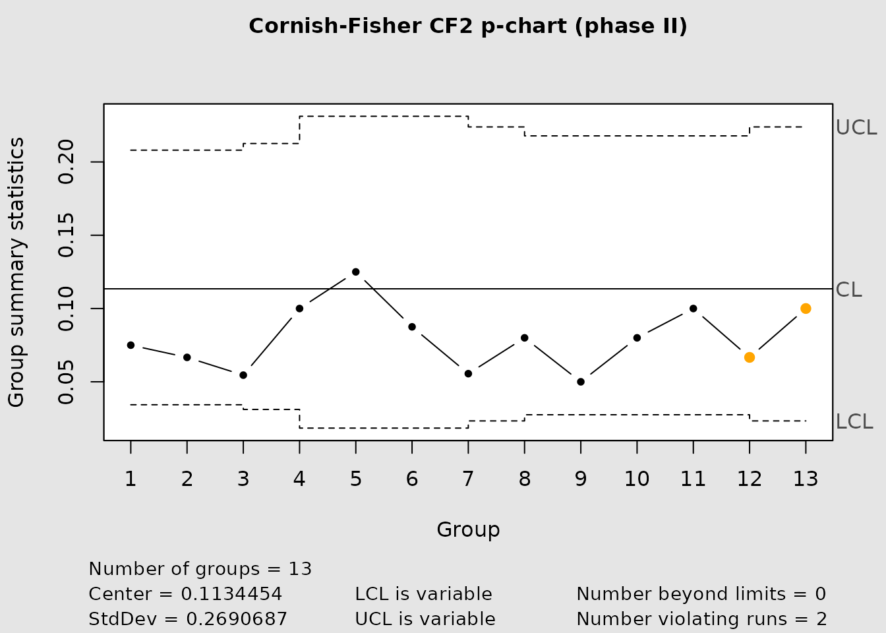
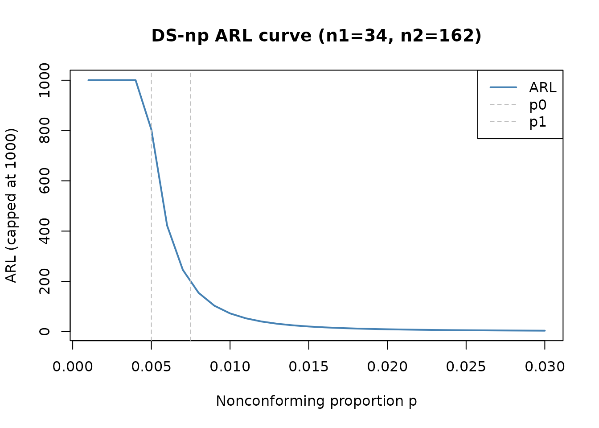
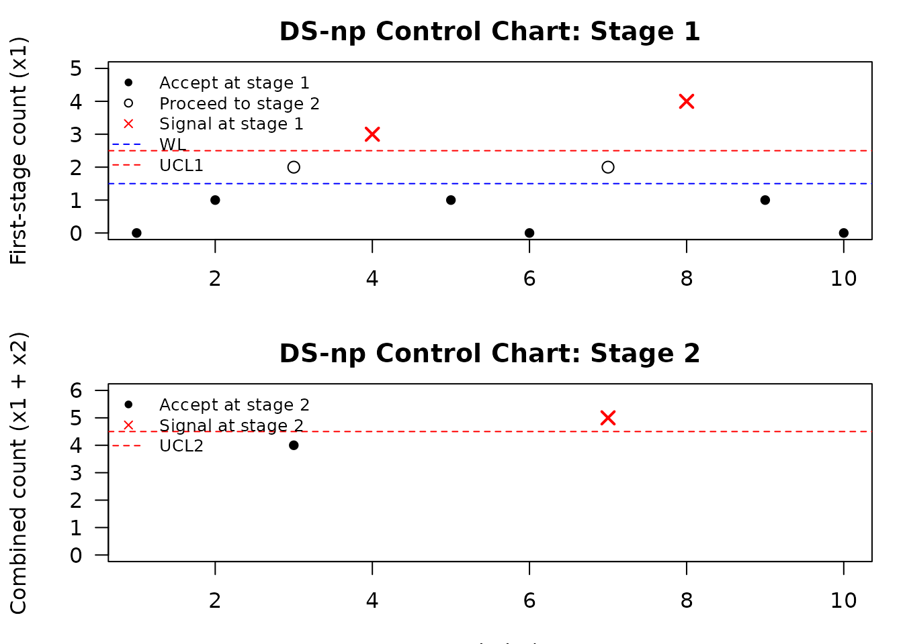

# High-quality processes and rare nonconformities

## Motivation

High-quality processes are processes in which nonconformities are rare.
In that setting, attribute data are highly discrete, bounded below by
zero, and often strongly asymmetric. Classical normal-approximation
control limits may therefore be poorly calibrated, even when the usual
chart is familiar and easy to apply.

IQCC addresses this problem with corrected p-chart limits, exact
binomial false-alarm calculations, and a complete double-sampling np
(DS-np) workflow including performance evaluation, automatic limit
search, chart construction, and plotting.

## When to correct the p chart

The standard p-chart three-sigma limits,

``` math
UCL = \hat p + 3\sqrt{\hat p(1 - \hat p)/n},\qquad
LCL = \hat p - 3\sqrt{\hat p(1 - \hat p)/n},
```

rely on a normal approximation to the binomial. When $`n p(1-p)`$ is
small, the binomial distribution is strongly discrete and asymmetric,
and the actual false-alarm probability of the normal limits can be far
from the nominal $`0.0027`$. IQCC provides two Cornish–Fisher
corrections:

- `type = "cf1"` applies the first correction term, driven by binomial
  skewness;
- `type = "cf2"` retains CF1 and adds the next terms of the
  Cornish–Fisher expansion used by Joekes and Barbosa (2013), involving
  the fourth standardized cumulant and the squared skewness
  contribution.

The following table compares the nominal and actual performance for
$`p = 0.015`$ and $`n = 20`$:

``` r

methods <- c("normal", "cf1", "cf2")
p_results <- do.call(
  rbind,
  lapply(methods, function(method) {
    lim <- pchart_limits(p = 0.015, n = 20, type = method)
    risk <- pchart_alpha_risk(
      p = 0.015,
      n = 20,
      lcl = lim$lcl,
      ucl = lim$ucl
    )
    data.frame(
      method = method,
      lcl = lim$lcl,
      center = lim$center,
      ucl = lim$ucl,
      npq = lim$npq,
      applicable = lim$applicable,
      actual_alpha = risk,
      arl0 = ifelse(risk == 0, Inf, 1 / risk)
    )
  })
)
p_results
#>   method lcl center        ucl    npq applicable actual_alpha       arl0
#> 1 normal   0  0.015 0.09653924 0.2955      FALSE 0.0357458712   27.97526
#> 2    cf1   0  0.015 0.16120479 0.2955       TRUE 0.0002023458 4942.03542
#> 3    cf2   0  0.015 0.13031923 0.2955       TRUE 0.0031780828  314.65511
```

The normal limits produce an ARL0 of only about 28 subgroups, far below
the nominal 370. The CF2 correction brings the actual risk substantially
closer to the target.

``` r

data(binomdata)
cchart.p(
  x1 = binomdata$Di[1:12],
  n1 = binomdata$ni[1:12],
  type = "cf2",
  x2 = binomdata$Di[13:25],
  n2 = binomdata$ni[13:25]
)
```



### Diagnosing p-chart applicability

Joekes and Barbosa (2013) propose the following practical guidance based
on $`n p(1-p)`$:

- use the normal limits when $`n p(1-p) \ge 5`$;
- CF1 is supported when $`n p(1-p) \ge 0.25`$;
- CF2 extends the corrected chart to $`n p(1-p) \ge 0.08`$;
- below $`0.08`$, another control-chart methodology is needed.

This is practical guidance rather than an exact theorem. The
`applicable` field returned by
[`pchart_limits()`](https://flaviobarros.github.io/IQCC/reference/pchart_limits.md)
implements these thresholds. For the example above:

``` r

p_results[, c("method", "npq", "applicable")]
#>   method    npq applicable
#> 1 normal 0.2955      FALSE
#> 2    cf1 0.2955       TRUE
#> 3    cf2 0.2955       TRUE
```

When more than one method is applicable, the exact binomial false-alarm
risk should still be inspected. A DS-np plan is not selected solely
because a p-chart approximation is poor: its ARL and inspection effort
must also be evaluated for the shifts that matter operationally.

## Double-sampling np charts

A double-sampling np chart uses two possible sampling stages. A first
sample of size $`n_1`$ is inspected. If the count of nonconforming items
is at most $`\lfloor WL \rfloor`$, the process is accepted. If it is at
least $`\lfloor UCL_1 \rfloor + 1`$, the chart signals immediately.
Otherwise the count lies in the warning zone and a second sample of size
$`n_2`$ is inspected. After the second sample, the process is accepted
when $`D_1 + D_2 \le \lfloor UCL_2 \rfloor`$ and signals otherwise.

IQCC provides the complete DS-np workflow:

- [`dsnp_prob_accept()`](https://flaviobarros.github.io/IQCC/reference/dsnp_prob_accept.md)
  computes the total acceptance probability;
- [`dsnp_arl()`](https://flaviobarros.github.io/IQCC/reference/dsnp_arl.md)
  computes average run length;
- [`dsnp_ass()`](https://flaviobarros.github.io/IQCC/reference/dsnp_ass.md)
  computes average sample size, with or without curtailed (truncated)
  second-stage inspection;
- [`dsnp_limits()`](https://flaviobarros.github.io/IQCC/reference/dsnp_limits.md)
  searches and ranks feasible fractional limits;
- [`dsnp_design()`](https://flaviobarros.github.io/IQCC/reference/dsnp_design.md)
  searches sample sizes and limits under explicit ARL and ASS
  constraints;
- [`cchart.DSnp()`](https://flaviobarros.github.io/IQCC/reference/cchart.DSnp.md)
  classifies observations and constructs the chart.

### Inspecting a published plan

Joekes, Smrekar and Barbosa (2015, Table 2) report a DS-np plan for
$`p_0 = 0.005`$ with $`n_1 = 34`$, $`n_2 = 162`$, $`WL = 1.5`$,
$`UCL_1 = 2.5`$, and $`UCL_2 = 4.5`$:

``` r

n1 <- 34
n2 <- 162
wl <- 1.5
ucl1 <- 2.5
ucl2 <- 4.5
p0 <- 0.005
p1 <- 0.0075

published_plan <- data.frame(
  metric = c("P(accept | p0)", "ARL0", "ARL1", "ASS0"),
  value = c(
    dsnp_prob_accept(p0, n1, n2, wl, ucl1, ucl2)$pt,
    dsnp_arl(p0, n1, n2, wl, ucl1, ucl2)$arl,
    dsnp_arl(p1, n1, n2, wl, ucl1, ucl2)$arl,
    dsnp_ass(p0, n1, n2, wl, ucl1)$ass
  )
)
published_plan
#>           metric       value
#> 1 P(accept | p0)   0.9987553
#> 2           ARL0 803.4114304
#> 3           ARL1 193.2228555
#> 4           ASS0  35.9353364
```

The published values are ARL0 = 803.41, ARL1 = 193.22, and ASS0 = 35.94
— all within rounding tolerance.

### Average sample size: complete versus curtailed inspection

By default,
[`dsnp_ass()`](https://flaviobarros.github.io/IQCC/reference/dsnp_ass.md)
assumes that whenever the first-stage count enters the warning zone, all
$`n_2`$ second-stage items are inspected. However, as soon as the
cumulative nonconformity count exceeds $`UCL_2`$ the rejection decision
is certain, and inspection can stop. This *curtailed* (truncated)
inspection reduces the average sample size without changing the signal
probability or ARL. The `curtailed` parameter in
[`dsnp_ass()`](https://flaviobarros.github.io/IQCC/reference/dsnp_ass.md)
enables this convention when the user also supplies `ucl2` (the vignette
example uses complete inspection; see the function documentation for the
curtailed option).

### ARL and ASS as functions of p

The performance of a DS-np plan varies with the true nonconforming
proportion. The following evaluation shows ARL and ASS across a grid of
$`p`$ values:

``` r

p_grid <- seq(0.001, 0.03, length.out = 30)
perf <- do.call(rbind, lapply(p_grid, function(p) {
  arl <- dsnp_arl(p, n1, n2, wl, ucl1, ucl2)$arl
  ass <- dsnp_ass(p, n1, n2, wl, ucl1)$ass
  data.frame(p = p, arl = arl, ass_complete = ass)
}))
head(perf)
#>       p         arl ass_complete
#> 1 0.001 161757.7315     34.08802
#> 2 0.002  18201.4162     34.34097
#> 3 0.003   4735.8341     34.74296
#> 4 0.004   1758.3823     35.27908
#> 5 0.005    803.4114     35.93534
#> 6 0.006    422.2120     36.69864
```

``` r

plot(perf$p, pmin(perf$arl, 1000), type = "l", col = "steelblue", lwd = 2,
     xlab = "Nonconforming proportion p", ylab = "ARL (capped at 1000)",
     main = "DS-np ARL curve (n1=34, n2=162)")
abline(v = p0, lty = 2, col = "gray")
abline(v = p1, lty = 2, col = "gray")
legend("topright", legend = c("ARL", "p0", "p1"),
       col = c("steelblue", "gray", "gray"), lty = c(1, 2, 2), lwd = c(2, 1, 1))
```



The ARL drops steeply as $`p`$ increases beyond $`p_0`$, illustrating
the chart’s ability to detect deterioration.

### Searching for limits

When no published plan is available,
[`dsnp_limits()`](https://flaviobarros.github.io/IQCC/reference/dsnp_limits.md)
enumerates and ranks feasible fractional limit combinations for fixed
sample sizes. A compact example:

``` r

lim <- dsnp_limits(
  p0 = 0.05,
  n1 = 5,
  n2 = 10,
  alpha = 0.05,
  p1 = 0.10,
  max_results = 5
)
lim$best[, c("wl", "ucl1", "ucl2", "p_signal0",
             "arl0", "arl1", "ass0")]
#>    wl ucl1 ucl2  p_signal0     arl0     arl1     ass0
#> 1 0.5  1.5  2.5 0.04013256 24.91743 5.951221 7.036266
```

### Searching a complete design

The full design search over $`n_1`$ and $`n_2`$ is performed by
[`dsnp_design()`](https://flaviobarros.github.io/IQCC/reference/dsnp_design.md).
The problem minimizes ARL1 subject to $`\text{ARL}_0 \ge
\text{arl0\_min}`$ and $`\text{ASS}_0 \le \text{ass0\_max}`$:

``` r

design <- dsnp_design(
  p0 = 0.05,
  p1 = 0.10,
  n1_range = 5:6,
  n2_range = 8:10,
  arl0_min = 50,
  ass0_max = 6,
  objective = "arl1",
  max_results = 5
)
design$best[, c("n1", "n2", "wl", "ucl1", "ucl2",
                "ass0", "arl0", "arl1")]
#>   n1 n2  wl ucl1 ucl2     ass0     arl0     arl1
#> 1  5 10 1.5  2.5  2.5 5.214344 102.4701 17.84397
```

The published tables in Joekes, Smrekar and Barbosa (2015) report
selected plans but not the complete bounds used for the searches over
$`n_1`$ and $`n_2`$ or every tie-breaking rule. IQCC tests recover a
published plan over an explicitly recorded local grid and validate the
exhaustive algorithm independently on a small grid.

### Trade-off between detection and sampling effort

Double sampling can reduce average inspection and improve sensitivity to
small or moderate increases in the nonconforming proportion, at the cost
of a variable workload and a more complex operating rule. In the
published reference plan above, the corresponding single-sampling chart
inspects 40 units every cycle. The DS-np chart starts with only 34 units
and has complete-inspection $`ASS_0 = 35.94`$, below 40, because most
decisions are made after the first sample. When the warning zone is
reached, however, a second sample of 162 units is required, so the
maximum workload in that cycle is much larger.

The `ass0_max` constraint in
[`dsnp_design()`](https://flaviobarros.github.io/IQCC/reference/dsnp_design.md)
lets the practitioner balance out-of-control detection against average
inspection effort. Curtailed inspection can reduce the effective
second-stage effort further without changing the signal probability or
ARL for a fixed plan.

### Interpreting fractional limits

For a DS-np plan with first-stage count $`D_1`$ and second-stage count
$`D_2`$, IQCC uses the following rule:

- accept at the first stage when $`D_1 \le \lfloor WL \rfloor`$;
- signal at the first stage when $`D_1 \ge \lfloor UCL_1 \rfloor + 1`$;
- otherwise inspect the second sample;
- after the second sample, accept when
  $`D_1 + D_2 \le \lfloor UCL_2 \rfloor`$;
- signal after the second stage otherwise.

The fractional limits allow intermediate non-integer thresholds that are
converted to the integer decision boundaries above.

### Constructing the chart

``` r

x1 <- c(0, 1, 2, 3, 1, 0, 2, 4, 1, 0)
x2 <- c(NA, NA, 2, NA, NA, NA, 3, NA, NA, NA)

chart <- cchart.DSnp(
  x1,
  n1 = 10,
  n2 = 20,
  p0 = 0.05,
  x2 = x2,
  wl = 1.5,
  ucl1 = 2.5,
  ucl2 = 4.5,
  p1 = 0.10,
  plot = TRUE
)
```



``` r


chart$limits
#> $wl
#> [1] 1.5
#> 
#> $ucl1
#> [1] 2.5
#> 
#> $ucl2
#> [1] 4.5
#> 
#> $wl_accept
#> [1] 1
#> 
#> $ucl1_reject
#> [1] 3
#> 
#> $ucl2_accept
#> [1] 4
chart$performance
#> $arl0
#> [1] 58.35236
#> 
#> $ass0
#> [1] 11.4927
#> 
#> $p_signal0
#> [1] 0.01713727
#> 
#> $arl1
#> [1] 7.531628
#> 
#> $ass1
#> [1] 13.8742
#> 
#> $p_signal1
#> [1] 0.1327734
chart$data
#>    index x1 x2 total         stage signal
#> 1      1  0 NA    NA  accept_first  FALSE
#> 2      2  1 NA    NA  accept_first  FALSE
#> 3      3  2  2     4 accept_second  FALSE
#> 4      4  3 NA    NA  signal_first   TRUE
#> 5      5  1 NA    NA  accept_first  FALSE
#> 6      6  0 NA    NA  accept_first  FALSE
#> 7      7  2  3     5 signal_second   TRUE
#> 8      8  4 NA    NA  signal_first   TRUE
#> 9      9  1 NA    NA  accept_first  FALSE
#> 10    10  0 NA    NA  accept_first  FALSE
```

``` r

cat("<!-- IQCC_EXECUTED_HIGH_QUALITY -->\n")
```

## Practical workflow

A practical high-quality-process workflow in IQCC is:

1.  Diagnose p-chart applicability with $`n \hat p(1-\hat p)`$ and the
    `applicable` field returned by
    [`pchart_limits()`](https://flaviobarros.github.io/IQCC/reference/pchart_limits.md).
2.  Compare normal, CF1, and CF2 limits with
    [`pchart_limits()`](https://flaviobarros.github.io/IQCC/reference/pchart_limits.md).
3.  Evaluate actual binomial risk with
    [`pchart_alpha_risk()`](https://flaviobarros.github.io/IQCC/reference/pchart_alpha_risk.md).
4.  Use
    [`cchart.p()`](https://flaviobarros.github.io/IQCC/reference/cchart.p.md)
    for routine p-chart monitoring when its calibration and sensitivity
    are adequate for the application.
5.  Evaluate DS-np with
    [`dsnp_limits()`](https://flaviobarros.github.io/IQCC/reference/dsnp_limits.md)
    or
    [`dsnp_design()`](https://flaviobarros.github.io/IQCC/reference/dsnp_design.md)
    when sensitivity to relevant shifts and inspection effort motivate
    double sampling.
6.  Evaluate ARL and ASS across the relevant $`p`$ range.
7.  Optionally compare complete and curtailed ASS via
    `dsnp_ass(curtailed = TRUE)`.
8.  Supply the selected design to
    [`cchart.DSnp()`](https://flaviobarros.github.io/IQCC/reference/cchart.DSnp.md)
    for operational monitoring.

## References

Joekes, S. and Barbosa, E. P. (2013). An improved attribute control
chart for monitoring non-conforming proportion in high quality
processes. *Control Engineering Practice*, 21, 407–412. doi:
[10.1016/j.conengprac.2012.12.005](https://doi.org/10.1016/j.conengprac.2012.12.005).

Joekes, S., Smrekar, M. and Barbosa, E. P. (2015). Extending a double
sampling control chart for non-conforming proportion in high quality
processes to the case of small samples. *Statistical Methodology*, 23,
35–49. doi:
[10.1016/j.stamet.2014.09.003](https://doi.org/10.1016/j.stamet.2014.09.003).
