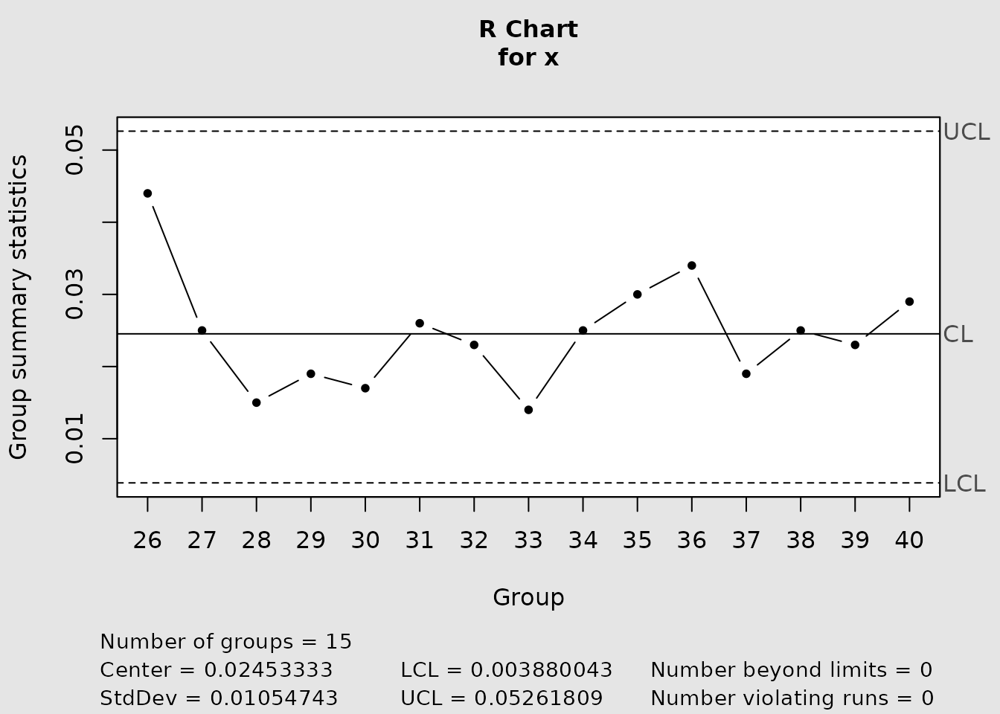
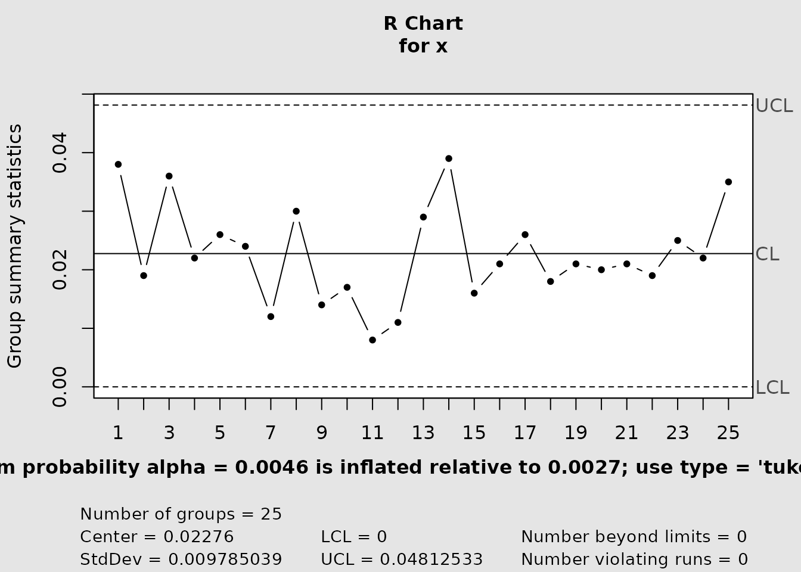
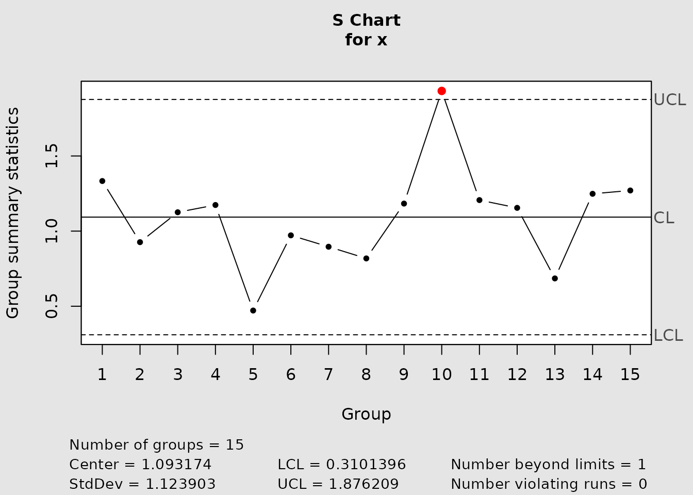
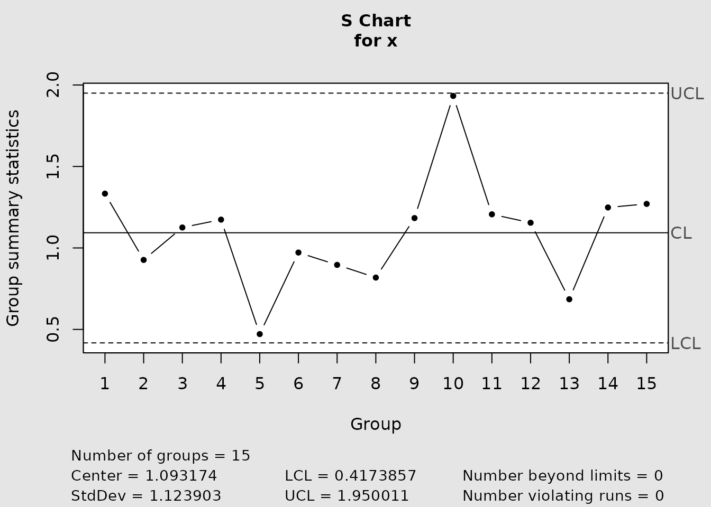

# Monitoring univariate dispersion with R and S charts

## Choosing a dispersion statistic

An R chart monitors each subgroup through its sample range

``` math
R = X_{(n)} - X_{(1)},
```

whereas an S chart monitors its sample standard deviation. The range is
easy to obtain and remains useful for the small, fixed subgroup sizes
common in routine process control. The standard deviation uses all
observations and is generally preferable as subgroup size increases.
Both charts assume independent subgroups from a stable process; the
exact probability calculations below also assume normal observations
within each subgroup.

The range and standard deviation are nonnegative and have skewed
sampling distributions at small sample sizes. A symmetric normal
approximation can therefore misplace one or both control limits. IQCC
exposes conventional and distribution-based versions through
[`cchart.R()`](https://flaviobarros.github.io/IQCC/reference/cchart.R.md)
and
[`cchart.S()`](https://flaviobarros.github.io/IQCC/reference/cchart.S.md).

## The relative range

For a normal process with standard deviation $`\sigma`$, Barbosa, Gneri,
and Meneguetti (2013) define the relative range

``` math
W = \frac{R}{\sigma}.
```

Its distribution function can be evaluated with the Tukey
studentized-range distribution at infinite denominator degrees of
freedom:

``` math
F_W(w;n) = F_{\mathrm{Tukey}}(w;n,\infty).
```

Consequently, `stats::ptukey(w, nmeans = n, df = Inf)` evaluates
$`F_W`$, and `stats::qtukey(p, nmeans = n, df = Inf)` obtains its $`p`$
quantile. The IQCC functions `d2(n)` and `d3(n)` calculate the mean and
standard deviation of $`W`$, respectively.

``` r

sizes <- c(2, 5, 10, 15)
data.frame(
  n = sizes,
  d2 = d2(sizes),
  d3 = d3(sizes)
)
#>    n       d2        d3
#> 1  2 1.128379 0.8525025
#> 2  5 2.325929 0.8640819
#> 3 10 3.077505 0.7970507
#> 4 15 3.471827 0.7562114
```

## Classical and exact R limits

The conventional three-sigma limits are

``` math
LCL_R = \max\{0,d_2(n)-3d_3(n)\}\hat\sigma,
\qquad
UCL_R = \{d_2(n)+3d_3(n)\}\hat\sigma.
```

For nominal two-sided false-alarm probability $`\alpha`$, equal-tail
exact probability limits are

``` math
LCL_R = F_W^{-1}(\alpha/2;n)\hat\sigma,
\qquad
UCL_R = F_W^{-1}(1-\alpha/2;n)\hat\sigma.
```

`cchart.R(type = "tukey")` uses $`\alpha=0.0027`$, so its probabilities
are 0.00135 and 0.99865. The scale estimate is obtained from the Phase I
reference subgroups supplied as `y`; the subgroups in `x` are then
plotted as Phase II. The chart signals below the lower limit or above
the upper limit.

## Reproducing Table 2

Table 2 of Barbosa et al. (2013) prints $`W`$ quantiles to five decimal
places. The following calculation reproduces small, intermediate, and
large rows directly from the stated Tukey relationship.

``` r

table2 <- data.frame(
  n = c(2, 5, 10),
  published_q_001 = c(0.00177, 0.36739, 1.08458),
  published_q_99865 = c(4.53274, 5.37740, 5.87416)
)
table2$calculated_q_001 <- stats::qtukey(
  0.001,
  nmeans = table2$n,
  df = Inf
)
table2$calculated_q_99865 <- stats::qtukey(
  0.99865,
  nmeans = table2$n,
  df = Inf
)
table2$error_q_001 <- table2$calculated_q_001 - table2$published_q_001
table2$error_q_99865 <-
  table2$calculated_q_99865 - table2$published_q_99865
table2
#>    n published_q_001 published_q_99865 calculated_q_001 calculated_q_99865
#> 1  2         0.00177           4.53274      0.001772454           4.532743
#> 2  5         0.36739           5.37740      0.367392008           5.377402
#> 3 10         1.08458           5.87416      1.084582650           5.874158
#>    error_q_001 error_q_99865
#> 1 2.454321e-06  2.812733e-06
#> 2 2.007667e-06  2.381641e-06
#> 3 2.650150e-06 -2.498414e-06
```

All discrepancies are below $`5\times10^{-6}`$, half a unit at the fifth
decimal place. The package’s tabular helper produces the same quantiles
for a chosen nominal alpha.

``` r

table.qtukey(alpha = 0.0027, n = 5)
#>       alpha/2       alpha  1-alpha 1-alpha/2
#> 2 0.002392814 0.004785635 4.242608  4.532743
#> 3 0.070003631 0.099034660 4.678703  4.950175
#> 4 0.220551642 0.278377858 4.938456  5.199657
#> 5 0.396528087 0.473383768 5.123140  5.377402
```

## False-alarm risk and subgroup size

For the classical limits, the actual in-control risk is

``` math
1 - \left[F_W\{d_2(n)+3d_3(n)\} -
F_W\{\max(0,d_2(n)-3d_3(n))\}\right].
```

[`alpha.risk()`](https://flaviobarros.github.io/IQCC/reference/alpha.risk.md)
performs this exact evaluation. It does not report a nominal design
value; it reports the probability induced by the conventional limits.

``` r

risk <- alpha.risk(sizes)
data.frame(
  n = sizes,
  nominal_alpha = 0.0027,
  actual_alpha = risk,
  inflation = risk / 0.0027,
  in_control_arl = 1 / risk
)
#>    n nominal_alpha actual_alpha inflation in_control_arl
#> 1  2        0.0027  0.009152215  3.389709       109.2632
#> 2  5        0.0027  0.004603048  1.704833       217.2473
#> 3 10        0.0027  0.004367441  1.617571       228.9670
#> 4 15        0.0027  0.004493839  1.664385       222.5269
```

The inflation is most severe for the smallest subgroups and remains
material over this range of $`n`$. Exact probability limits instead
allocate the chosen tail probabilities by construction, conditional on
the process scale used to form them.

## Phase I and Phase II with an R chart

Phase I reference data establish the process scale and the fixed limits.
Phase II data are prospective subgroups evaluated against that design.
The exact IQCC wrapper makes this split explicit through `y` and `x` for
the limits.

``` r

data(pistonrings)
phase1 <- pistonrings[1:25, ]
phase2 <- pistonrings[26:40, ]

r_chart <- cchart.R(
  x = phase2,
  n = 5,
  type = "tukey",
  y = phase1
)
```



``` r

r_chart$limits
#>         LCL         UCL
#>  0.003880043 0.05261809
r_chart$statistics
#>    26    27    28    29    30    31    32    33    34    35    36    37    38 
#> 0.044 0.025 0.015 0.019 0.017 0.026 0.023 0.014 0.025 0.030 0.034 0.019 0.025 
#>    39    40 
#> 0.023 0.029
```

The returned `qcc` object’s center line is still the mean range
calculated from `x`, not the Phase I expected range based on `y`. Thus
the current wrapper freezes the Phase I scale for its limits but does
not freeze every displayed design quantity. This distinction does not
change the limit-crossing signals, but it matters when interpreting the
center line.

The conventional wrapper delegates scale estimation and limits to `qcc`
using the supplied `x`. It is appropriate for a retrospective chart of a
stable reference data set, but its interface does not accept a separate
Phase I scale for prospective Phase II monitoring.

``` r

r_chart_classical <- cchart.R(
  x = phase1,
  n = 5,
  type = "norm"
)
```



``` r

r_chart_classical$limits
#>  LCL        UCL
#>    0 0.04812533
```

## S charts

For normal samples,

``` math
\frac{(n-1)S^2}{\sigma^2} \sim \chi^2_{n-1}.
```

This gives equal-tail probability limits

``` math
\hat\sigma\sqrt{\frac{\chi^2_{\alpha/2,n-1}}{n-1}}
\quad\text{and}\quad
\hat\sigma\sqrt{\frac{\chi^2_{1-\alpha/2,n-1}}{n-1}}.
```

`cchart.S(type = "n")` requests the normalized `qcc` chart, while
`cchart.S(type = "e", m = n)` uses the chi-square formula with
$`\alpha=0.0027`$. In the current interface, both variants estimate the
scale from `x`; there is no separate Phase I/Phase II argument.

For comparison, the three-sigma construction underlying a classical S
chart uses $`E(S)=c_4(n)\sigma`$ and $`SD(S)=\sigma\sqrt{1-c_4(n)^2}`$.
With a process-scale estimate $`\hat\sigma`$, its limits have the form

``` math
\max\{0,c_4(n)-3\sqrt{1-c_4(n)^2}\}\hat\sigma
\quad\text{and}\quad
\{c_4(n)+3\sqrt{1-c_4(n)^2}\}\hat\sigma.
```

As with R, these moment-based limits are not equal-tail probability
limits for small $`n`$.

``` r

data(softdrink)
s_chart_normalized <- cchart.S(softdrink, type = "n")
```



``` r

s_chart_exact <- cchart.S(softdrink, type = "e", m = 10)
```



``` r


rbind(
  normalized = s_chart_normalized$limits,
  exact = s_chart_exact$limits
)
#>        LCL      UCL
#>  0.3101396 1.876209
#>  0.4173857 1.950011
```

## Interpretation and limitations

A point above the upper limit indicates increased within-subgroup
dispersion; a point below a positive lower limit indicates decreased
dispersion. A signal is evidence against the in-control model, not a
diagnosis of its cause. Check data quality, rational subgrouping,
independence, and process context before acting on it.

The exact calibration relies on normal within-subgroup observations and
a fixed known scale. Operational charts replace that scale by a Phase I
estimate. Their limits are therefore plug-in limits and do not account
for additional uncertainty from estimating $`\sigma`$, especially when
the number of reference subgroups is small. The current R and S
graphical wrappers also do not expose all displayed limits through
dedicated pure numerical limit functions; use the returned `qcc`
object’s `limits` component when auditing a fitted chart.

## References

Barbosa, E. P., Gneri, M. A., and Meneguetti, A. (2013). Range control
charts revisited: Simpler Tippett-like formulae, its practical
implementation, and the study of false alarm. *Communications in
Statistics - Simulation and Computation*, 42(2), 247–262. doi:
[10.1080/03610918.2011.639967](https://doi.org/10.1080/03610918.2011.639967).

Montgomery, D. C. (2009). *Introduction to Statistical Quality Control*,
6th ed. Wiley.

``` r

cat("<!-- IQCC_EXECUTED_UNIVARIATE_DISPERSION -->\n")
```
